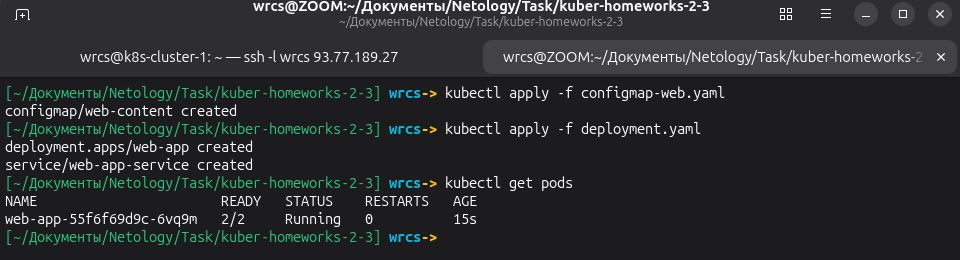
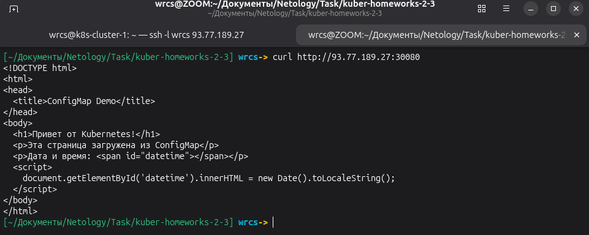
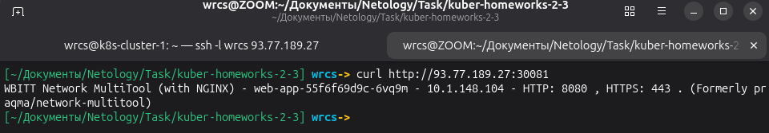
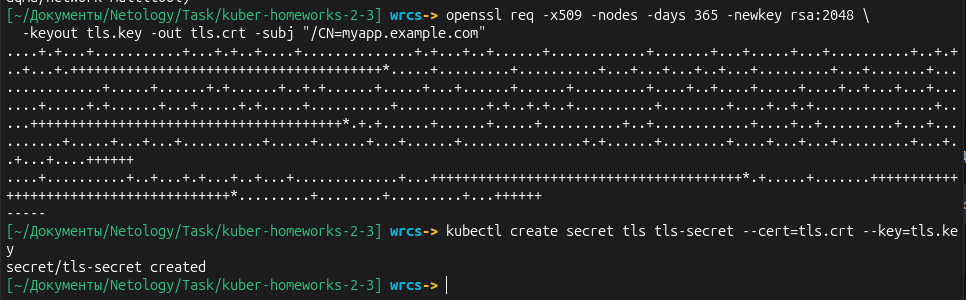
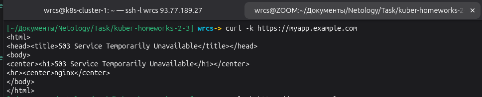
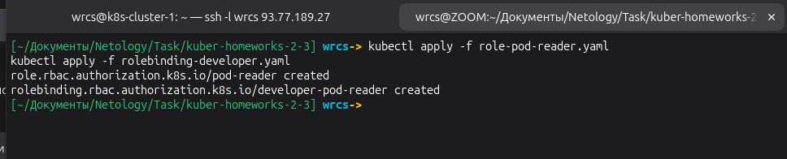
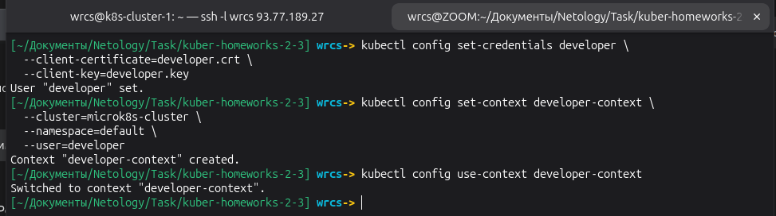
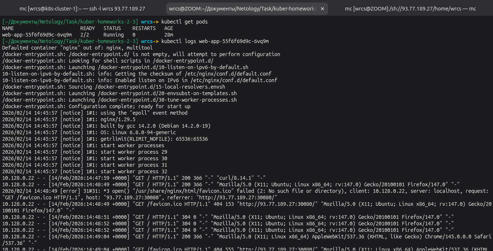
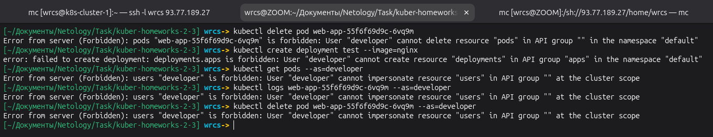

# Домашнее задание к занятию «Настройка приложений и управление доступом в Kubernetes» Малявко С.Н.

### Задание 1: Работа с ConfigMaps
#### Развернуть приложение (nginx + multitool), решить проблему конфигурации через ConfigMap и подключить веб-страницу. 

### Задание 2: Настройка HTTPS с Secrets
#### Развернуть приложение с доступом по HTTPS, используя самоподписанный сертификат.

### Задание 3: Настройка RBAC
#### Создать пользователя с ограниченными правами (только просмотр логов и описания подов).

### Команды генерации сертификатов

#### Для TLS
openssl req -x509 -nodes -days 365 -newkey rsa:2048 -keyout tls.key -out tls.crt -subj "/CN=myapp.example.com"

#### Для RBAC
openssl genrsa -out developer.key 2048
openssl req -new -key developer.key -out developer.csr -subj "/CN=developer"
openssl x509 -req -in developer.csr -CA ca.crt -CAkey ca.key -CAcreateserial -out developer.crt -days 365

### Файлы манифестов

- [configmap-web.yaml](configmap-web.yaml)
- [deployment.yaml](deployment.yaml)
- [secret-tls.yaml](secret-tls.yaml)
- [ingress-tls.yaml](ingress-tls.yaml)
- [role-pod-reader.yaml](role-pod-reader.yaml)
- [rolebinding-developer.yaml](rolebinding-developer.yaml)
- [values.yaml](values.yaml)

### ✅ ЗАДАНИЕ ВЫПОЛНЕНО
